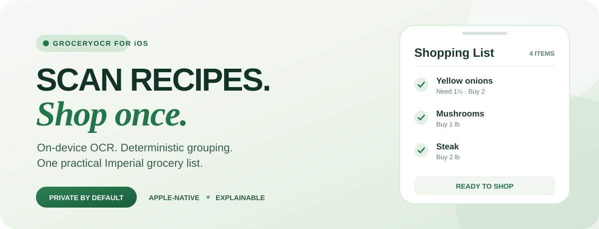
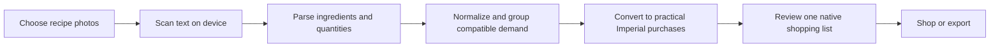
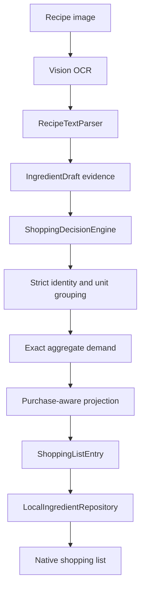

<p align="center">
  
</p>

<p align="center">
  <strong>Recipe photos become a grocery list that understands how people actually shop.</strong><br>
  <sub>Private by default · Apple-native · Imperial measurements · Deterministic decisions</sub>
</p>

---

# GroceryOCR

## Stop transcribing recipes. Start shopping.

GroceryOCR is an iOS app that scans recipe images, extracts ingredient requirements with on-device text recognition, combines compatible ingredients across recipes, and turns fractional demand into a practical shopping list.

No spreadsheet. No mental arithmetic. No `1.25 onions` in the produce aisle.

## The objective

**Turn scattered recipe instructions into one trustworthy buying plan.**

Recipes describe what cooking requires. Shoppers need to know what to buy. GroceryOCR bridges that gap without handing quantity decisions to a generative model:

- preserve the original recipe evidence;
- recognize quantities, units, ingredient identities, and modifiers;
- combine only ingredients that are safe to group;
- convert shopping output to familiar U.S. Imperial units;
- round discrete groceries only after total demand is known;
- explain which decisions were automatic and which need review.

## The user flow



### 1 — Capture

Choose one or more recipe screenshots or photos from the iOS photo library.

### 2 — Understand

Apple Vision recognizes text on device. GroceryOCR parses ingredient names, rational quantities, units, ranges, and identity-changing modifiers.

### 3 — Consolidate

The deterministic decision engine converts compatible measurements, merges matching ingredients, and preserves conflicting varieties or purchase forms as separate decisions.

### 4 — Make it shoppable

Fractional recipe demand becomes a safe purchase quantity. Counted items round upward only after aggregation; weighted and liquid items remain accurate in Imperial units.

### 5 — Review and go

The shopper receives one Apple-native list with demand, buying quantity, review states, local persistence, deletion, and CSV export.

## The outcome

| Before GroceryOCR | After GroceryOCR |
|---|---|
| Ingredients scattered across screenshots | One consolidated shopping list |
| Repeated items hidden across recipes | Compatible demand grouped automatically |
| Fractions that make sense only while cooking | Practical whole-item and Imperial purchase quantities |
| Silent guesses about ingredient identity | Strict grouping with visible review states |
| Manual conversion and arithmetic | Exact rational calculations with deterministic rules |
| A generic utility interface | A minimal, Apple-native review experience |

### A small decision with a useful result

```text
Recipe A:  ½ onion
Recipe B:  ¾ onion
           ─────────
Needed:    1¼ onions
Buy:       2 onions
Reason:    grouped first, then rounded to whole items
```

The same rule produces the same answer every time. The app does not ask an LLM to perform shopping arithmetic.

## Product outcomes

### Less transcription

The recipe image is the input. The shopper does not rebuild an ingredient list by hand.

### Fewer duplicate purchases

Compatible mentions are aggregated before the list is produced, revealing total demand across recipes.

### No automatic underbuying

Known demand is preserved or rounded upward according to the purchase mode. Ambiguity becomes a review state rather than an invisible guess.

### Familiar quantities

Shopping output uses U.S. Imperial measures such as ounces, pounds, teaspoons, tablespoons, cups, pints, quarts, and gallons.

### Explainable decisions

Original OCR text, exact demand, shopping demand, grouping behavior, and review requirements remain traceable.

### Private by default

Text recognition runs on device, and shopping sessions persist locally. Recipe images are not required to leave the phone.

## Built like an iPhone product

The interface uses native SwiftUI patterns instead of a custom dashboard shell:

- `NavigationStack` and grouped `List` structure;
- `PhotosPicker` for recipe import;
- native progress, empty, error, and ready states;
- swipe actions for list maintenance;
- `ShareLink` for export;
- Dynamic Type-friendly labels and system imagery;
- system backgrounds, spacing, and hierarchy.

The experience is intentionally quiet: import, scan, review, shop.

## How the product reasons



The deterministic domain layer is separate from OCR and interface code. That separation makes parsing, grouping, conversion, persistence, and presentation independently testable.

## Current product status

The application builds successfully with:

- on-device OCR through Apple Vision;
- deterministic ingredient parsing and aggregation;
- exact rational quantity arithmetic;
- Imperial conversion and presentation;
- purchase-aware whole-item rounding;
- duplicate-image fingerprinting;
- local JSON persistence and CSV export;
- unit tests for the decision engine and repository;
- an Apple-native SwiftUI shopping flow.

## What comes next

### Local flyer deal planning

The proposed deal-planning experience would let shoppers declare local stores, retrieve authorized weekly-flyer data through a controlled MCP/provider boundary, match verified deals to the grocery list, and organize a suggested store plan without allowing the model to invent prices or silently substitute ingredients.

[Follow future feature issue #1 →](https://github.com/ptw1255/GroceryOCR/issues/1)

## Run the app

1. Open `GroceryOCR.xcodeproj` in Xcode.
2. Select the `GroceryOCR` scheme.
3. Choose an iPhone simulator or connected device.
4. Build and run.
5. Import recipe images and choose **Run scan**.

No external package dependency is required for the current on-device flow.

## Product and engineering plans

- [Stabilization and test plan](docs/01-stabilization-and-test-plan.md) — dependency map, test instrumentation, CI gates, and implementation order.
- [Native iOS redesign plan](docs/02-ios-native-redesign-plan.md) — experience map, wireframes, state model, native component strategy, and vertical slices.
- [Deterministic ingredient aggregation](docs/03-deterministic-ingredient-aggregation-plan.md) — exact parsing, strict grouping, conversion, purchase rounding, and fixtures.
- [Imperial shopping decision engine](docs/04-imperial-shopping-decision-engine.md) — purchase-aware grouping, package behavior, explanations, and overrides.
- [Local deal-planning proposal](https://github.com/ptw1255/GroceryOCR/issues/1) — future authorized flyer matching through MCP and provider adapters.

## Repository map

```text
GroceryOCR/            iOS application source
  Domain/              deterministic ingredient and quantity rules
  Services/            OCR, orchestration, and dependency boundaries
  ContentView/         Apple-native shopping experience
GroceryOCRTests/       unit and integration tests
GroceryOCRUITests/     UI test target
docs/                  product and engineering plans
GroceryOCR.xcodeproj/  Xcode project
```

---

<p align="center">
  <strong>From recipe image to shopping aisle.</strong><br>
  <sub>GroceryOCR keeps the arithmetic exact and the experience simple.</sub>
</p>
