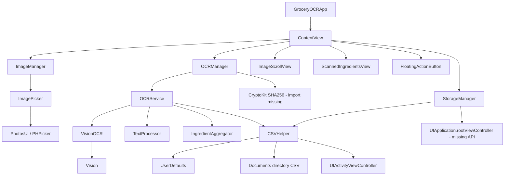
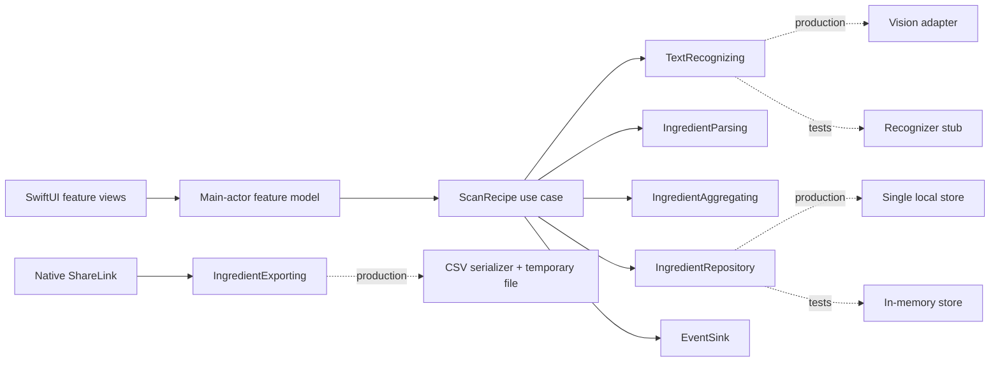

# GroceryOCR stabilization and test plan

Status: implementation-ready plan; no production code changed  
Audit date: 2026-09-01  
Validated with: Xcode 26.2, Swift 5 language mode, iPhone 16 Pro / iOS 18.2 simulator

## Outcome

Restore a repeatable iOS build, put the OCR pipeline behind testable boundaries, and make every pull request prove that the product's critical path still works:

> import recipe images → recognize text → derive ingredients → review/store → export

The first milestone is not feature work. It is a green, deterministic build-and-test contract that later UI work can safely depend on.

## Evidence-based baseline

The repository currently fails both build and test:

```text
xcodebuild ... build  → exit 65
xcodebuild ... test   → exit 65
```

Confirmed compile blockers:

1. `ContentView/OCRManager.swift:32` calls `SHA256.hash` without importing `CryptoKit`.
2. `ContentView/StorageManager.swift:24` calls `UIApplication.rootViewController`, but no such API or project extension exists.

Testing is effectively absent:

- The unit target contains one empty Swift Testing template.
- The UI target only launches the app and measures launch performance.
- Tests cannot execute because the application target does not compile.

Additional build hygiene findings:

- The project declares no Swift Package Manager or third-party dependencies. All runtime dependencies are Apple frameworks.
- The README calls the product an iOS/macOS app, while the application target supports only `iphoneos` and `iphonesimulator` and imports UIKit throughout.
- `SDKROOT = auto` and mixed generated platform settings produce an `xcodebuild` destination warning. The platform contract should be made explicit.
- The deployment target is iOS 18.2 rather than a deliberate product support floor.
- The app icon catalog has slots but no image filenames.
- macOS sandbox entitlements are present in an iOS-only target.
- A preview-only `read.me` file is copied into the built application because it is inside a synchronized source group.
- Camera usage text is declared, but the product only exposes the photo library picker.

## Current dependency map



### Dependency inventory

| Layer | Current implementation | Platform dependency | Main concern |
|---|---|---|---|
| Composition | `GroceryOCRApp`, `ContentView` | SwiftUI | View constructs concrete managers; dependencies cannot be substituted. |
| Image acquisition | `ImagePicker`, `ImageManager` | PhotosUI, UIKit | UIKit wrapper where native SwiftUI exists; unlimited images; errors ignored. |
| Orchestration | `OCRManager`, `OCRService` | UIKit, CryptoKit | UI-coupled APIs, callback orchestration, no typed state or errors. |
| Recognition | `VisionOCR` | Vision, UIKit | Synchronous request can block the initiating thread; confidence and orientation are discarded. |
| Interpretation | `TextProcessor`, `IngredientAggregator` | Foundation | String-only model, narrow regex, unstable dictionary order, behavior does not match comments. |
| Persistence/export | `CSVHelper`, `StorageManager` | UserDefaults, FileManager, UIKit | Two sources of truth, global state, swallowed errors, O(n²) batch writes, no CSV escaping. |
| Presentation | SwiftUI views | SwiftUI | Hard-coded black theme, icon-only actions, no progress/error/review state. |

## Product correctness risks after compilation

These are not compiler errors, but they prevent the current implementation from being considered working:

### Priority 0 — release blockers

- Sharing is coupled to an undefined global root view controller.
- OCR runs without a visible processing state, cancellation, failure state, or retry path.
- Persistence and export failures are printed but never surfaced to the user or caller.
- There are no assertions covering the core product behavior.

### Priority 1 — data correctness

- Each recognized ingredient triggers a full read and CSV rewrite; a batch can partially persist if interrupted.
- UserDefaults and the CSV file are duplicate mutable stores and can diverge.
- CSV values are joined with newlines without quoting or escaping.
- Ingredients are stored as identity-less strings. Deleting one value deletes every matching value.
- Aggregation is limited to one OCR batch and returns dictionary order, so results are nondeterministic.
- The parser accepts only a small decimal/unit vocabulary; common recipe fractions and Unicode fractions are unsupported.
- `TextProcessor` can discard a pending valid ingredient when an unrelated line appears. Its continuation rule can also absorb substitution notes before the substitution rule runs.
- An image hash is marked processed before OCR succeeds, preventing an in-session retry after failure.

### Priority 2 — operability and maintenance

- `print` statements are the only diagnostics and include recognized user text.
- Images and OCR services use concrete UIKit types throughout, making deterministic tests difficult.
- Unused `HashListView` and stale preview documentation obscure the actual product surface.
- No shared CI workflow, coverage report, result bundle retention, or branch quality gate exists.

## Target technical boundary

The stabilization should introduce seams before expanding behavior. These are roles, not a requirement for separate frameworks on day one.



Required contracts:

- `TextRecognizing`: image input → recognized lines with confidence and location, or typed failure.
- `IngredientParsing`: recognized lines → structured ingredient drafts plus rejected lines.
- `IngredientAggregating`: deterministic normalization and combination rules.
- `IngredientRepository`: atomic load/save/delete/clear with an injectable store.
- `IngredientExporting`: stored ingredients → a shareable URL, with RFC-compatible CSV escaping.
- `ImageFingerprinting`: stable fingerprint from input bytes; only committed after successful processing.
- `EventSink`: privacy-safe lifecycle and performance events; spyable in tests.

## Test and instrumentation schema

### Testability controls

The app composition root should select real dependencies in production and deterministic substitutes in tests. UI tests need launch arguments rather than access to global state:

| Launch control | Purpose |
|---|---|
| `-ui-testing` | Disable animations and nonessential nondeterminism. |
| `-reset-store` | Start with an empty isolated store. |
| `-seed-fixture <name>` | Load known ingredient/session data. |
| `-recognizer-mode success\|empty\|partial\|failure` | Exercise UI states without invoking Vision or the system photo picker. |

Every primary action, row, status, and error must have a stable accessibility identifier. Identifiers describe semantics (`scan.primaryAction`, `review.ingredientRow`) rather than layout.

### Operational event envelope

Use one typed envelope for `Logger`/signpost output and for an injected test spy:

```text
ProductEvent
  name: EventName
  flow_id: UUID
  stage: import | recognize | parse | persist | export
  result: started | succeeded | failed | cancelled
  timestamp: Date
  duration_ms: Int?            // completion events only
  item_count: Int?             // aggregate count only
  error_code: StableErrorCode? // no localized error text
  build_version: String
```

Initial event names:

- `scan_import`
- `ocr_batch` and `ocr_image`
- `ingredient_parse`
- `ingredient_save`
- `ingredient_export`
- `scan_flow_completed`

Privacy rule: never log images, recognized text, ingredient names, filenames, full hashes, file URLs, or user identifiers. Tests should assert event sequence and metadata, not console strings.

### Test pyramid

| Level | Required coverage | Representative assertions | Execution |
|---|---|---|---|
| Unit | Parser, aggregation, CSV serializer, fingerprinting, state transitions | Fractions, unitless items, continuations, substitutions, deterministic ordering, CSV quoting, retry eligibility | Every PR |
| Integration | Use case + fakes + temporary/in-memory repository | Multi-image success, partial OCR failure, duplicate image, atomic save, migration, export contents | Every PR |
| Vision contract | Small checked-in image fixtures | Text present/empty, rotation, low contrast; tolerant assertions on expected key lines and minimum confidence | Every PR if stable; otherwise scheduled |
| UI smoke | Empty, seeded, processing, review, error, export-ready states | Launch, complete core flow, edit/delete, retry, destructive confirmation, accessibility labels | Every PR for one device |
| UI/adaptive | Dynamic Type, dark/light, iPhone/iPad, VoiceOver audit | No clipped primary actions; semantics and focus order remain usable | Scheduled and before release |
| Performance | OCR fixture batch, launch, parser corpus | Detect material regressions using measured baselines rather than arbitrary wall-clock promises | Scheduled and before release |

High-value unit cases:

1. Decimal, ASCII fraction, Unicode fraction, no-unit, hyphenated, and multiline ingredient forms.
2. A valid ingredient followed by noise remains in the result.
3. Substitution notes are classified before generic continuation text.
4. Duplicate names normalize case and whitespace; quantities combine only under explicit unit rules.
5. Aggregation output has stable ordering.
6. CSV values containing commas, quotes, and newlines round-trip correctly.
7. Repository save is atomic and deletion operates by ID, not value.
8. Failed OCR does not permanently mark an image complete; successful OCR does.
9. A partial multi-image failure produces reviewable results and a retryable error.

## Build contract

### Local commands to standardize

The implementing PR should provide one documented command per contract, optionally wrapped by repository scripts:

1. Debug simulator build with signing disabled.
2. Release simulator build with signing disabled.
3. Unit and integration tests on one pinned simulator runtime.
4. UI smoke tests on one pinned iPhone simulator.
5. Unsigned generic-device archive to catch archive-only configuration failures.

All commands must use an explicit project, shared scheme, configuration, destination, and derived-data path. “Works in my currently selected Xcode UI” is not a build contract.

### CI gates

Create a GitHub Actions workflow on a pinned macOS/Xcode image. The workflow should:

1. Print the selected Xcode and Swift versions.
2. Fail fast on project/scheme discovery.
3. Build Debug and Release.
4. Run unit/integration tests with code coverage.
5. Run the core UI smoke flow in a separate job.
6. Upload `.xcresult`, build logs, screenshots, and coverage output when a job fails.
7. Cancel superseded runs on the same pull request.
8. Require the build and unit/integration jobs before merge; add UI smoke as required once flake-free.

Coverage is a guardrail, not the product goal. Establish a baseline first, then target at least 85% line coverage for pure domain/serialization code and 70% for the application module. Exclude generated assets and UI boilerplate from threshold calculations.

## Ordered implementation plan

### Phase 0 — define the platform contract

- Declare the product iOS-only in project settings and documentation.
- Choose and document the minimum iOS version. Recommendation: iOS 18.0 for the Swift-native Vision API; lower only if market reach requires the legacy adapter.
- Normalize `SDKROOT`, supported platforms, target device families, entitlements, privacy strings, app icon assets, and shared scheme behavior.
- Record the exact local build/test commands in the README.

Exit criteria: Xcode and command-line tooling resolve one unambiguous iOS application target and shared scheme without the current supported-platform warning.

### Phase 1 — restore compilation with native ownership

- Import CryptoKit where hashing remains temporarily required.
- Remove root-view-controller discovery from the storage layer. Make export produce a URL and let SwiftUI own presentation through `ShareLink`.
- Convert swallowed errors into typed results presented by the feature model.
- Keep this change behaviorally narrow; do not mix the visual redesign into the repair PR.

Exit criteria: clean Debug and Release simulator builds plus unsigned archive.

### Phase 2 — establish deterministic domain seams

- Introduce the six contracts described above and inject them at the app composition root.
- Replace string identity with structured `Ingredient`, `ScanSession`, `SourceAsset`, and `RecognizedLine` models defined in the redesign plan.
- Select one source of truth for stored ingredients; generate CSV only for export.
- Move OCR work off the main actor and express orchestration with structured concurrency.
- Make partial success, cancellation, retry, and duplicate handling explicit states.
- Migrate legacy `scannedText` once, preserving user data and marking migration completion.

Exit criteria: the full scan use case runs deterministically with fakes and a temporary repository.

### Phase 3 — build the safety net

- Replace template tests with the unit, integration, Vision contract, and UI smoke suites.
- Check in small, synthetic or properly licensed fixture images; include expected outcomes in machine-readable fixtures.
- Add launch controls, accessibility identifiers, event spy, and isolated storage.
- Establish a measured coverage baseline and performance baselines.

Exit criteria: a failing parser, persistence, OCR orchestration, or critical UI-flow regression produces a specific failed assertion.

### Phase 4 — enforce CI

- Add the build/test workflow and artifact retention.
- Protect `main` with required build and unit/integration checks.
- Quarantine no tests silently. A flaky test receives an owner, linked issue, and expiry date.
- Schedule the adaptive UI and performance suites.

Exit criteria: a fresh clone can reproduce CI locally, and a deliberately introduced compile or behavior defect blocks merge.

### Phase 5 — harden for redesign

- Run Instruments on the fixture batch to set image-count and memory limits.
- Validate migration against a copy of legacy storage.
- Add privacy review for diagnostics and fixtures.
- Freeze the domain contracts before beginning the UI vertical slices.

Exit criteria: the redesign can replace views without rewriting OCR, parsing, persistence, or tests.

## Definition of “builds correctly”

The product is not considered repaired merely when Xcode emits an `.app`. Completion requires:

- Debug and Release simulator builds pass from a clean clone.
- An unsigned generic-device archive passes.
- No missing app icon, platform, entitlement, or privacy-purpose warnings remain.
- All required unit, integration, and UI smoke tests pass.
- The critical flow reports progress and recoverable failures without freezing or losing accepted data.
- CI publishes actionable result bundles on failure and blocks regressions from `main`.

## Non-goals for stabilization

- No visual redesign in the compiler-repair PR.
- No cloud backend, account system, cross-device sync, nutrition database, or AI service.
- No analytics containing recipe images or recognized text.
- No broad parser rewrite without fixture-backed acceptance cases.

## Primary references

- [Apple: Testing](https://developer.apple.com/documentation/xcode/testing) — test-pyramid guidance and the roles of Swift Testing and XCTest UI testing.
- [Apple: Adding tests to an Xcode project](https://developer.apple.com/documentation/xcode/adding-tests-to-your-xcode-project) — dependency substitution, integration tests, and critical-flow UI tests.
- [Apple: RecognizeTextRequest](https://developer.apple.com/documentation/vision/recognizetextrequest) — the Swift-native asynchronous Vision request used by the recommended iOS 18 adapter.
- [GitHub: Building and testing Swift](https://docs.github.com/en/actions/tutorials/build-and-test-code/swift) — CI workflow structure and hosted macOS/Swift tooling.
