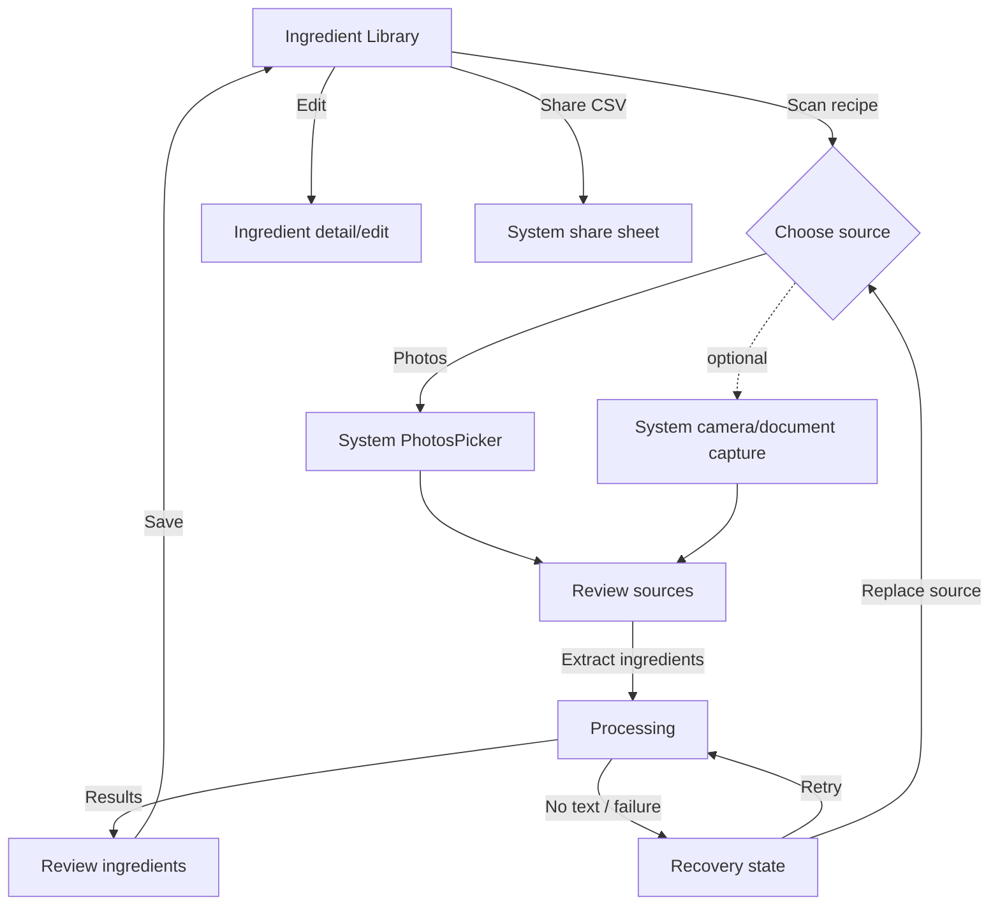
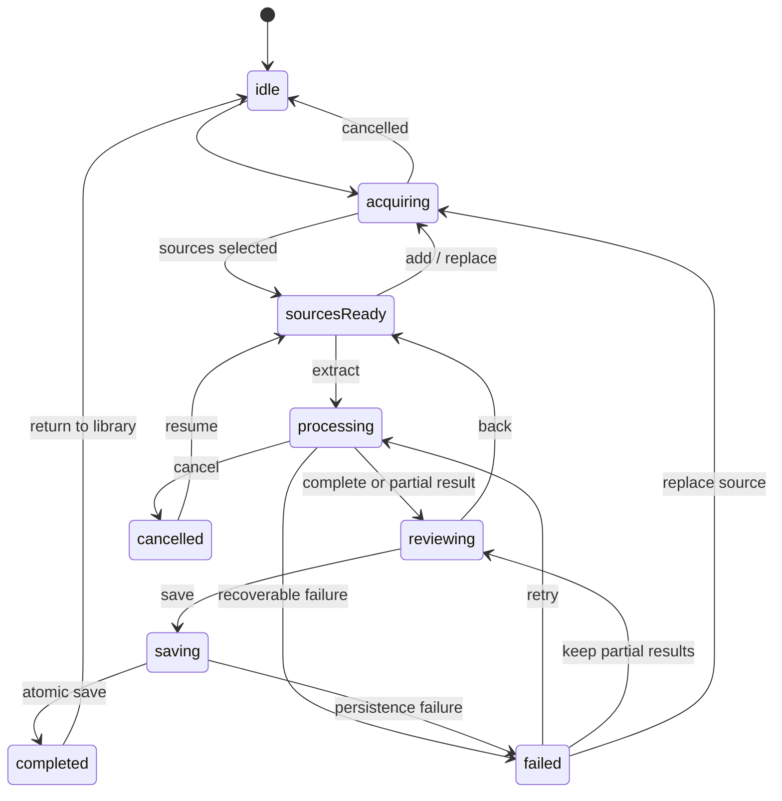
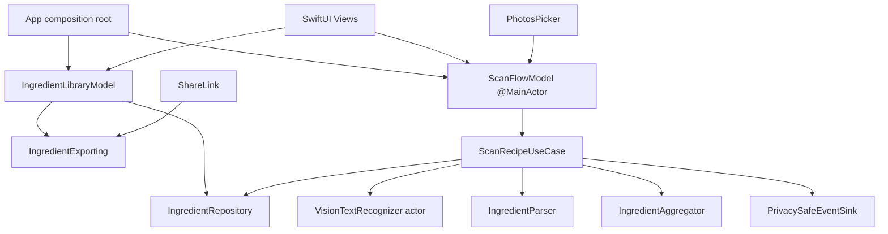

# GroceryOCR native iOS redesign plan

Status: product schema and implementation plan; no UI code included  
Dependency: begin after the stabilization plan reaches Phase 3

## Product outcome

GroceryOCR should feel like a focused Apple-platform utility: choose or capture recipe images, see what the app understood, correct the result, and keep or share a clean ingredient list.

The redesign optimizes for three outcomes:

1. **Confidence:** the user can see what is processing, what was extracted, and what needs attention.
2. **Speed:** one obvious primary action moves the user through the flow; system controls handle selection, navigation, lists, editing, and sharing.
3. **Recovery:** empty OCR, partial results, permissions, cancellation, and storage/export failures have a visible next action.

## Experience inventory

The existing code implies these product experiences:

| Existing experience | Current expression | Preserve as outcome | Redesign decision |
|---|---|---|---|
| Launch | Black canvas titled “Grocery Scanner” | Understand the product and start quickly | Native navigation title plus empty/library state. |
| Add images | Floating photo icon opens unlimited PHPicker | Bring one or more recipe images into a scan | Native `PhotosPicker`; cap selection based on measured memory. |
| Review images | Horizontal thumbnails with remove buttons | Confirm the correct pages before OCR | Dedicated source review with count, reorder/remove, and primary “Extract ingredients.” |
| Run OCR | Floating viewfinder icon | Know work started and finishes | Progress state with per-batch status, cancel, and recoverable error. |
| View ingredients | Fixed-height string list | Understand and trust extracted results | Full review list with structured, editable rows and confidence cues only when actionable. |
| Delete | Trash button per string | Remove an incorrect result | Native swipe action; undo where practical. |
| Export | Floating share icon opens UIKit share sheet | Share a standards-compliant CSV | Native `ShareLink` from the saved list. |
| Clear | Floating destructive icon clears immediately | Reset stored results deliberately | Destructive menu action with confirmation. |

Current-product gaps that the redesign must close:

- “Scan” suggests camera capture, and a camera permission string exists, but no camera experience is implemented.
- There is no review/edit step between OCR and persistence.
- There is no loading, completion, empty-result, partial-result, failure, cancellation, or retry presentation.
- Icon-only floating actions do not communicate a sequence or hierarchy.
- The forced black theme ignores system appearance and accessibility preferences.
- The accumulated string list has no scan/session provenance.

## Recommended MVP scope

### In scope

- One iOS app with no tab bar.
- Ingredient Library as the root screen.
- Photo selection as the guaranteed acquisition path.
- A source-review → processing → ingredient-review flow.
- Edit, add, remove, save, clear, and CSV share.
- On-device Vision recognition and local persistence.
- Native light/dark appearance, Dynamic Type, VoiceOver, keyboard support on iPad, and reduced-motion behavior.

### Conditional MVP item

Camera capture should be included only if “scan from paper” is a launch requirement. If included, use an Apple-provided document/camera experience and feed it into the same `SourceAsset` boundary. Do not build a custom camera UI for MVP.

### Out of scope

- Accounts, cloud sync, collaboration, recipe management, meal planning, nutrition lookup, barcode scanning, remote AI parsing, or a custom design system.
- A multi-tab information architecture.
- Showing internal hashes, raw telemetry, or developer diagnostics to users.

## Information architecture



One `NavigationStack` owns Library, source review, and ingredient review. Acquisition is presented by system UI. Processing is part of the scan flow, not a detached global overlay. Destructive actions live in a toolbar menu rather than beside the primary action.

## Wireframes

### 1. Library — empty

```text
┌──────────────────────────────┐
│ Grocery OCR              ••• │
│                              │
│          [document]          │
│     No ingredients yet       │
│ Scan a recipe to turn its    │
│ photos into a clean list.    │
│                              │
│   [ Scan a recipe          ] │
│   [ Choose photos          ] │
└──────────────────────────────┘
```

Use a native empty-state treatment. “Scan a recipe” is the single emphasized action. If camera is deferred, “Choose photos” becomes the primary action and the scan label is not shown.

### 2. Library — populated

```text
┌──────────────────────────────┐
│ Ingredients             ••• │
│ 12 items                     │
│ ┌──────────────────────────┐ │
│ │ 2 cups   all-purpose flour│ │
│ │ 1 tsp    kosher salt      │ │
│ │ 3        large eggs       │ │
│ └──────────────────────────┘ │
│                              │
│ [ + Scan another recipe   ]  │
└──────────────────────────────┘
```

Rows use native list behavior. Swipe exposes Delete; tapping a row opens edit. Share CSV and Clear All live in the overflow menu. The primary action remains visible and labeled.

### 3. Source review

```text
┌──────────────────────────────┐
│ ‹ Cancel      3 pages    Add │
│                              │
│ [ page 1 ] [ page 2 ]        │
│ [ page 3 ]                    │
│                              │
│ Remove or replace any page   │
│ before extraction.           │
│                              │
│ [ Extract ingredients      ] │
└──────────────────────────────┘
```

Each source has a visible remove action and accessible page position. A reasonable maximum is selected after memory testing; the current unlimited picker is not retained by default.

### 4. Processing and recovery

```text
┌──────────────────────────────┐
│ Extracting ingredients       │
│                              │
│           ◌                  │
│       Page 2 of 3            │
│ Recognizing text on device…  │
│                              │
│          Cancel              │
└──────────────────────────────┘

┌──────────────────────────────┐
│ We couldn't read page 2      │
│ Two pages are ready to       │
│ review. Retry this page or   │
│ continue with the results.   │
│                              │
│ [ Retry page               ] │
│ [ Review 8 ingredients     ] │
└──────────────────────────────┘
```

Progress reports facts, not invented percentages. Partial success preserves usable work.

### 5. Ingredient review

```text
┌──────────────────────────────┐
│ ‹ Sources       Review       │
│ 8 ingredients      Add       │
│ ┌──────────────────────────┐ │
│ │ 2 cups   flour          › │ │
│ │ 1 tsp    salt           › │ │
│ │ ?         baking soda ! › │ │
│ └──────────────────────────┘ │
│                              │
│ [ Save ingredients         ] │
└──────────────────────────────┘
```

Low-confidence treatment appears only when it asks the user to verify a row. The user can edit quantity, unit, name, and note; remove false positives; and add missing items before saving.

## Flow state schema

The UI should render from one explicit scan state rather than several unrelated booleans:

```text
ScanFlowState
  idle
  acquiring
  sourcesReady(sourceIDs)
  processing(completed: Int, total: Int, partialDraftIDs: [ID])
  reviewing(draftIDs: [ID], warnings: [ReviewWarning])
  saving
  completed(sessionID)
  failed(stage: ScanStage, error: UserFacingError, partialDraftIDs: [ID])
  cancelled(resumableSourceIDs: [ID])
```

Allowed transitions:



Invariant: only the orchestration layer changes `ScanFlowState`; views send intents and render state.

## Product data schema

The schema is implementation-neutral. SwiftData is a reasonable local-store adapter, but the domain types should not depend on a persistence framework.

### `ScanSession`

| Field | Type | Rules |
|---|---|---|
| `id` | UUID | Stable identity. |
| `createdAt` | Date | Set when acquisition starts. |
| `completedAt` | Date? | Set after atomic save. |
| `status` | draft / processing / review / completed / failed / cancelled | Stored only if resumable sessions are in scope. |
| `sourceIDs` | ordered `[SourceAsset.ID]` | Preserves page order. |
| `ingredientIDs` | ordered `[Ingredient.ID]` | Stable display/export order. |
| `schemaVersion` | Int | Supports migration. |

### `SourceAsset`

| Field | Type | Rules |
|---|---|---|
| `id` | UUID | Stable within a session. |
| `sessionID` | UUID | Owning session. |
| `kind` | photo / cameraDocument | Acquisition provenance without exposing a filename. |
| `pageIndex` | Int | Zero-based ordered position. |
| `fingerprint` | opaque value | Local duplicate detection; never logged. |
| `importedAt` | Date | Lifecycle tracking. |
| `processingStatus` | pending / processing / succeeded / failed | Supports per-page retry. |
| `errorCode` | stable code? | No raw OCR content. |

Do not persist full source images after a completed scan unless a later product requirement justifies the privacy and storage cost.

### `RecognizedLine`

| Field | Type | Rules |
|---|---|---|
| `id` | UUID | Stable review identity. |
| `sourceID` | UUID | Traceability to a page. |
| `text` | String | User content; never telemetry. |
| `confidence` | Float? | Normalized 0...1 when Vision supplies it. |
| `boundingBox` | normalized rectangle? | Enables future source highlighting; optional for MVP UI. |
| `lineIndex` | Int | Stable reading order. |

Raw recognized lines are transient by default. Persist only if the review experience needs them after app termination.

### `Ingredient`

| Field | Type | Rules |
|---|---|---|
| `id` | UUID | Deletion and editing use ID, never display text. |
| `sessionID` | UUID | Provenance. |
| `name` | String | Required after trim; user-editable. |
| `quantity` | Decimal? | Optional; preserve precision. |
| `unit` | normalized enum/custom value? | Keep recognized display text separately if normalization is uncertain. |
| `note` | String? | Preparation or substitution detail. |
| `sourceLineIDs` | `[UUID]` | Traceability for review/debug without telemetry. |
| `confidence` | Float? | Derived conservatively; never imply false precision. |
| `needsReview` | Bool | Set by explicit parser rules. |
| `createdAt` / `updatedAt` | Date | Local lifecycle. |
| `position` | Int | Deterministic list/export order. |

### `UserFacingError`

```text
UserFacingError
  code: acquisition_failed | unreadable_image | no_text | parse_empty |
        persistence_failed | export_failed | unknown
  title: localized key
  recoveryMessage: localized key
  actions: retry | replaceSource | reviewPartial | cancel
  isRecoverable: Bool
```

Errors cross layers by stable code. The view owns localized language; diagnostics retain the underlying system error privately without showing technical strings to the user.

## Proposed implementation architecture



Architecture rules:

- SwiftUI views do not call Vision, UserDefaults, FileManager, or UIKit controllers.
- The main actor owns observable UI state; OCR and image decoding do not run on it.
- Domain rules are pure and deterministic.
- Persistence is one source of truth; CSV is generated on demand.
- Every external boundary has a protocol and test substitute.
- UIKit bridging is isolated to a dedicated adapter only when no suitable SwiftUI API exists.

## Native component map

| Need | Native component | Usage |
|---|---|---|
| Navigation | `NavigationStack`, toolbar | Single-column flow and platform-standard back behavior. |
| Photo selection | `PhotosPicker` | Multiple image selection with a measured maximum. |
| Empty state | `ContentUnavailableView` or equivalent native composition | Clear explanation and action. |
| Lists/editing | `List`, `Form`, swipe actions, `TextField` | Familiar row behavior, edit, delete, and accessibility. |
| Progress | `ProgressView` | Indeterminate or factual page count. |
| Sharing | `ShareLink` with generated file URL | Removes root-view-controller discovery. |
| Confirmation | `confirmationDialog` / `alert` | Clear all, discard review, and recoverable failures. |
| Appearance | Semantic materials, `tint`, SF Symbols | System light/dark behavior without a parallel design system. |
| Observation | Swift Observation or an equivalent main-actor model | One-way intent/state flow. |
| OCR | Swift-native Vision request on iOS 18+ | Async, on-device text recognition with confidence/location. |

## Visual and interaction principles

- Use system background, grouped list, label, separator, and destructive colors. Do not hard-code black or white.
- Use one app tint and SF Symbols; color communicates action/status, not decoration.
- Use text labels for primary actions. Icons may accompany labels but do not replace them.
- Keep the primary action in the content hierarchy or safe-area action region; destructive actions stay separated.
- Prefer native spacing, typography, list rows, sheets, and toolbars over custom floating controls and cards.
- Support large Dynamic Type without hiding scan, retry, save, or cancel actions.
- Provide 44-point effective targets, VoiceOver labels/hints, logical focus order, and non-color review indicators.
- Respect Reduce Motion and system appearance. Landscape and iPad should reflow, not scale down.
- Use progress and error copy that states what happened and what the user can do next.

## Outcome and telemetry schema

Measure whether the redesign improves the experience without collecting recipe content:

| Outcome | Privacy-safe measure | MVP target-setting method |
|---|---|---|
| Reach value | Median time from first acquisition action to review-ready | Establish internal baseline with fixture/device testing, then improve. |
| Complete flow | `scan_flow_completed / scan_import started` | Compare by app version; segment only by coarse source type. |
| OCR utility | Sessions reaching review with at least one draft | Count only; no text or names. |
| Correction burden | Aggregate edited/removed/added counts per completed flow | No field values. |
| Recovery | Recoverable failures followed by retry or partial review | Stable error code only. |
| Export reliability | Successful exports / attempted exports | No destination or file URL. |
| Responsiveness | OCR duration per page and peak memory in test instrumentation | Device class and fixture ID in test systems only. |

Product analytics are optional. Local `OSLog` signposts and automated performance tests are sufficient for MVP engineering observability.

## Vertical-slice implementation plan

### Slice 1 — stable shell and empty library

- Replace the black `NavigationView` composition with a semantic `NavigationStack` root.
- Implement empty and populated library states using fixture/in-memory data.
- Add labeled scan/share/clear/edit actions and accessibility identifiers.
- Preserve existing stored strings through the migration adapter.

Acceptance: empty, one-item, many-item, light, dark, and accessibility text sizes are usable; library behavior is covered by state and UI tests.

### Slice 2 — native image acquisition and source review

- Adopt `PhotosPicker` and asynchronous `Transferable` loading.
- Enforce tested count/pixel/memory limits and show per-item loading errors.
- Add ordered source review, add, remove, cancel, and discard confirmation.
- If camera is approved for MVP, add its isolated system adapter here.

Acceptance: selected images can be reviewed and removed; cancellation loses no previously saved ingredients; iCloud-load failure has a recovery action.

### Slice 3 — observable processing

- Connect the tested scan use case to `ScanFlowModel`.
- Present page-based progress, cancellation, partial success, failure, and retry.
- Use signposts and event-spy assertions for every pipeline stage.
- Keep image work off the main actor.

Acceptance: the UI stays responsive during the fixture batch; failed pages can retry; accepted partial results remain available.

### Slice 4 — ingredient review and structured persistence

- Render structured drafts in deterministic order.
- Add native edit form, add/delete, review warning, and save.
- Save the session and ingredients atomically through the repository.
- Complete and test migration from legacy `[String]` UserDefaults data.

Acceptance: users can correct every exported field before save; a save failure preserves review state; duplicate display text does not break identity.

### Slice 5 — export and lifecycle polish

- Generate escaped CSV from the single repository source of truth.
- Present with `ShareLink` and surface generation failures.
- Add clear-all confirmation, undo where practical, launch restoration policy, and final empty/error copy.
- Run adaptive UI, accessibility audit, performance, and archive gates.

Acceptance: export fixtures round-trip; there is no root-controller lookup; all required CI checks pass.

## Release acceptance scenarios

1. A first-time user chooses two photos, removes one, extracts, corrects a row, saves, and shares CSV.
2. OCR finds no text and offers a clear replace/retry path without saving an empty result.
3. One page fails in a three-page scan; the user reviews successful results and can retry only the failed page.
4. The user cancels processing and returns to source review without corrupting the library.
5. Storage fails during save; editable review data remains and retry succeeds.
6. Existing `scannedText` data migrates once and remains editable/exportable.
7. Duplicate ingredient names retain distinct identity until the user explicitly combines or removes them.
8. VoiceOver and large Dynamic Type can complete acquisition (through seeded UI state), review, save, delete, and export.
9. Light and dark appearance use semantic contrast with no hard-coded black surface.
10. A clean CI clone builds Debug/Release, archives, and passes the required test suite.

## Decisions to lock before implementation

| Decision | Recommendation | Why |
|---|---|---|
| Minimum OS | iOS 18.0 | Enables the Swift-native async Vision API while remaining below the current project toolchain runtime. |
| Camera in MVP | Product decision; default to photos first | Camera is implied but not implemented, and it adds permission/device-only test scope. |
| Persistent source images | Do not retain after completion | Minimizes private-data and storage exposure. |
| Persistence adapter | SwiftData behind `IngredientRepository`, or a simple atomic file store if migration risk is lower | Keeps domain/tests independent from storage technology. |
| Parser expansion | Fixture-driven incremental rules | Prevents an unbounded “understand every recipe” rewrite. |
| iPad layout | Adaptive single-column MVP | Avoids unnecessary split navigation while preserving native resizing. |

## Primary references

- [Apple: PhotosPicker](https://developer.apple.com/documentation/photosui/photospicker)
- [Apple: NavigationStack](https://developer.apple.com/documentation/swiftui/navigationstack)
- [Apple: ShareLink](https://developer.apple.com/documentation/swiftui/sharelink)
- [Apple: RecognizeTextRequest](https://developer.apple.com/documentation/vision/recognizetextrequest)
- [Apple: Recognizing text in images](https://developer.apple.com/documentation/vision/recognizing-text-in-images)
