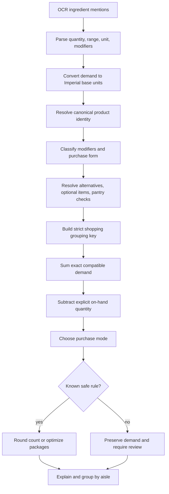
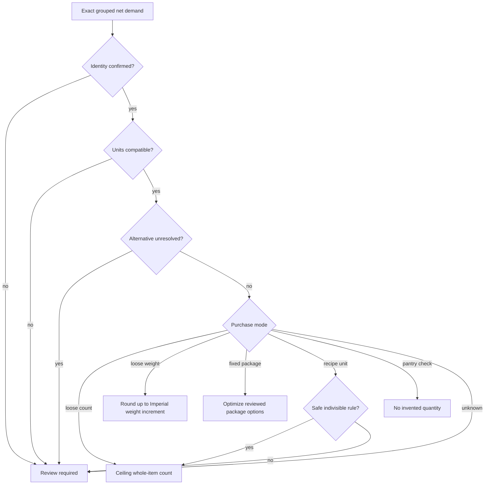

# Imperial shopping decision engine

Status: advanced feature specification; no production code included  
Depends on: [deterministic ingredient aggregation](03-deterministic-ingredient-aggregation-plan.md)

## Outcome

Convert OCR-derived recipe requirements into a concise, aisle-organized U.S. shopping list that answers:

- Which mentions refer to the same product?
- How much do all recipes require?
- What quantity can the shopper actually buy?
- Why did the app merge, split, convert, or round the item?
- Which decisions need confirmation?

The visible shopping experience uses U.S. Imperial units only. The parser may accept a non-Imperial source recipe so the ingredient is not lost, but it converts the demand at the ingestion boundary. Metric units never appear as shopping-list output.

## Product principles

1. **Never underbuy automatically.** An automatic purchase decision must satisfy or exceed known demand.
2. **Do not destroy evidence.** Original OCR text and exact recipe demand remain traceable.
3. **Round at the end.** Group and sum before applying purchase increments or packages.
4. **Prefer a review over a guess.** Ambiguous identity, incompatible units, alternatives, and unknown purchase forms remain visible.
5. **Explain every transformation.** Each row can show its contributions and rule trace.
6. **Make user intent authoritative.** Explicit package preferences, on-hand quantities, and overrides win over defaults.
7. **Version the result.** A named ruleset makes the same input reproducible.

## Imperial measurement contract

### Canonical base units

| Dimension | Internal base | Shopping display choices |
|---|---|---|
| Count | each | each, pair, half-dozen, dozen, package |
| Mass | ounce | ounce; pound + ounce |
| Volume | fluid ounce | teaspoon, tablespoon, fluid ounce, cup, pint, quart, gallon |
| Recipe unit | exact canonical token | clove, sprig, bunch, head, can, jar, bottle, bag, box |

Exact U.S. conversions:

```text
3 teaspoons       = 1 tablespoon
2 tablespoons     = 1 fluid ounce
8 fluid ounces    = 1 cup
2 cups            = 1 pint
2 pints           = 1 quart
4 quarts          = 1 gallon
16 ounces         = 1 pound
12 each           = 1 dozen
```

Non-Imperial OCR input is converted with one versioned fixed conversion table into ounces or fluid ounces. The original token remains only in source evidence. The conversion cannot bridge mass and volume.

### Display policy

- Prefer mixed fractions over decimal counts: `1¼ onions`, not `1.25 onions`.
- Show mass below one pound in ounces; show larger mass as pounds plus ounces: `1 lb 2 oz`.
- Show recipe volume in the largest familiar exact unit that keeps a readable mixed fraction.
- Show store packages by package identity: `2 × 14.5 oz cans`.
- Never show false precision created by OCR or conversion.
- Screen-reader labels expand abbreviations: “one pound, two ounces,” not “one L B two O Z.”

## Decision pipeline



## Decision context schema

```text
ShoppingDecisionContext
  measurementSystem: usImperial                 // fixed for MVP
  locale: en_US
  rulesVersion: String
  unitTableVersion: String
  identityCatalogVersion: String
  purchaseCatalogVersion: String
  displayPolicyVersion: String
  userPackagePreferences: [CanonicalIngredientID: PackageOption]
  onHand: [CanonicalIngredientID: ExactQuantity]
  purchaseOverrides: [ShoppingListItem.ID: PurchaseOverride]
```

The context is an explicit input. The engine does not read hidden globals, store location, or prior behavior to make a different decision.

## Ingredient purchase profile

The versioned local catalog supplies reviewed shopping behavior:

```text
IngredientPurchaseProfile
  canonicalIngredientID: String
  aisle: Produce | MeatSeafood | DairyEggs | Bakery | Pantry |
         CannedGoods | Frozen | Beverages | Household | Other
  allowedForms: [fresh, frozen, canned, dried, jarred, bottled, generic]
  purchaseMode: looseCount | looseWeight | fixedPackage |
                variablePackage | recipeUnit | pantryCheck | unknown
  wholeItemIncrement: RationalQuantity?          // normally 1 each
  looseWeightIncrement: RationalQuantity?        // normally 1 oz for display
  packageOptions: [PackageOption]                // only reviewed options
  preparationRules: [ModifierRule]
  identityRules: [ModifierRule]
  genericVariantPolicy: exactOnly | absorbSingleSpecific | requireReview
```

The catalog starts small and expands only through reviewed fixtures. Absence from the catalog produces `unknown`, not an invented rule.

## Advanced identity and grouping logic

### Modifier classes

| Class | Examples | Grouping effect |
|---|---|---|
| Preparation | chopped, diced, sliced, divided, softened | Usually ignored in the shopping key; retained in evidence. |
| Variety | red/yellow onion, Granny Smith apple | Splits groups unless an explicit generic rule applies. |
| Product form | fresh, frozen, canned, dried, jarred | Splits groups because the shopper buys different products. |
| Dietary/specification | unsalted, low-sodium, gluten-free, whole milk | Splits groups. |
| Size/grade | large eggs, baby carrots | Splits when it changes the purchased product or count meaning. |
| Optionality | optional, for garnish | Preserved as optional and excluded from required totals by default. |
| Pantry instruction | to taste, as needed | Becomes a pantry-check row without an invented amount. |

Modifier handling is ingredient-specific when language is ambiguous. For example, `diced onion` is generally preparation, while `canned diced tomatoes` is a purchased product form.

### Strict grouping key

```text
ShoppingGroupingKey
  canonicalIngredientID
  purchaseForm
  identityModifiers: sorted set
  dietaryModifiers: sorted set
  sizeGrade: canonical value?
  dimension: count | mass | volume | package | recipeUnit
  explicitPackageSize: ImperialQuantity?
```

Only equal keys merge automatically after compatible conversion.

### Generic and specific variants

Use this deterministic rule:

1. If every mention is generic, merge them.
2. If generic mentions coexist with exactly one specific variant and the profile allows `absorbSingleSpecific`, assign the generic demand to that variant and record the decision.
3. If generic mentions coexist with multiple specific variants, keep the generic demand separate and require review.
4. Never absorb a generic product across conflicting forms or dietary specifications.

Example:

- `1 onion + 1 yellow onion` may become `2 yellow onions` under a reviewed onion profile.
- `1 onion + 1 yellow onion + 1 red onion` remains three decisions until the user assigns the generic onion.

### OCR correction

- Apply exact, reviewed aliases for recurring OCR variants.
- Suggest—but do not automatically apply—general spelling-distance matches.
- A user confirmation may create a local override, not silently mutate the shared rules catalog.
- Low confidence in the quantity, unit, negation, or identity always requires review.

## Quantity semantics before grouping

### Ranges

For `2–3 onions`, preserve the range and use the upper bound for the automatic shopping projection:

```text
Needed: 2–3 onions
Buy: 3 onions
Reason: conservative upper-bound policy
```

### Alternatives

For `butter or oil`, create a choice group. Do not place both products in required totals. The user selects one before the flow is complete.

### Optional ingredients

Optional demand is grouped separately and shown under “Optional.” It does not increase required purchase quantity unless the user includes it.

### Missing quantities and “to taste”

Create a “Check pantry” row. Do not default to `1`.

### On-hand quantity

Only explicit user-entered inventory can reduce shopping demand:

```text
netDemand = max(0, aggregateDemand - compatibleOnHandQuantity)
```

The list shows the deduction. The app never assumes a staple is already available.

## Purchase modes

### Loose count

For whole produce and other discrete items:

```text
buyCount = ceil(netDemand / wholeItemIncrement) × wholeItemIncrement
```

Examples: onion, lemon, avocado. Size variants stay separate unless a reviewed equivalence exists.

### Loose weight

For deli, butcher, and weight-sold produce:

- Aggregate in ounces.
- Round upward only to the configured purchasable/display increment, normally 1 oz.
- Display 18 oz as `1 lb 2 oz`.
- Do not integer-round pounds.

### Fixed package

Use a package plan only when package options come from:

1. an explicit recipe package size;
2. an explicit user preference; or
3. a reviewed local purchase profile.

Do not infer a can, jar, carton, or bag size from an ingredient name alone.

### Variable package

If store package size varies and no selected option exists, preserve the Imperial demand and label it “about” only when the underlying rule is approximate. Require review when satisfying demand cannot be guaranteed.

### Recipe unit

Units such as bunch, sprig, clove, head, and stalk sum only with the identical canonical unit. Fractional values are review-required unless a specific profile declares the unit indivisible and safely roundable.

### Pantry check

No automatic quantity. Combine duplicate checks by canonical identity and preserve notes such as “to taste.”

## Package optimizer

Given exact net demand and reviewed package options, enumerate bounded package combinations that satisfy demand. Choose the minimum lexicographic score:

```text
score = (
  shortage,             // must be zero when a satisfying combination exists
  surplusAmount,
  packageCount,
  numberOfPackageSizes,
  deterministicPackageSignature
)
```

This means:

1. never choose a shortage;
2. minimize unused surplus;
3. then minimize the number of packages;
4. then prefer fewer distinct package sizes;
5. break any remaining tie using a stable descending-size signature.

Price is absent from the score because the app has no reliable store price data. If pricing is added later, it must be an explicit versioned input rather than an inferred preference.

### Package examples

| Demand | Available options | Decision | Explanation |
|---:|---|---|---|
| `21 fl oz broth` | `14.5 fl oz can` | `2 cans` | 29 fl oz supplied; smallest satisfying explicit package plan. |
| `18 oz pasta` | `16 oz box` | `2 boxes` | One box would underbuy. |
| `32 fl oz milk` | `1 qt`, `½ gal` | `1 qt` | Exact fit with one package. |
| `20 fl oz sauce` | `12 fl oz`, `24 fl oz` | `1 × 24 fl oz jar` | Less surplus and fewer packages than two 12 fl oz jars. |

## Automatic decision policy



An automatic result is allowed only when identity, quantity, unit dimension, and purchase behavior are all confirmed. Confidence affects whether a decision can be automatic; it never changes the arithmetic.

## Shopping-list organization

The default list is grouped by the catalog's stable aisle order:

1. Review Needed
2. Produce
3. Meat & Seafood
4. Dairy & Eggs
5. Bakery
6. Pantry
7. Canned Goods
8. Frozen
9. Beverages
10. Household
11. Other
12. Optional

Within an aisle, preserve the earliest contributing recipe/page/line order unless the user explicitly reorders the row. Aisle assignment is editable and persists as a local override.

### Row presentation

```text
Produce

2 yellow onions
1¼ needed · rounded to whole items

1 lb 2 oz ground beef
10 oz + ½ lb combined

Review Needed

1½ bunches cilantro
Confirm a whole-bunch purchase quantity
```

The primary value is what to buy. Secondary text states the exact requirement and transformation. A detail screen shows source mentions, unit conversions, on-hand deduction, package calculation, and override controls.

### Detail decision schema

```text
PurchaseDecision
  shoppingListItemID: UUID
  exactDemand: ImperialQuantityOrRange
  onHandDeduction: ImperialQuantity?
  netDemand: ImperialQuantityOrRange
  purchaseMode: PurchaseMode
  selectedPackages: [PackageSelection]
  buyQuantity: ImperialQuantity
  suppliedQuantity: ImperialQuantity?
  surplusQuantity: ImperialQuantity?
  autonomy: automatic | userConfirmed | userOverridden | reviewRequired
  aisle: Aisle
  trace: AggregationTrace
  warnings: ordered [StableWarningCode]
```

## Decision examples

| Input mentions | Shopping result | Automatic? | Rule |
|---|---|---|---|
| `½ onion + ¾ onion` | `2 onions` | Yes | Sum to 1¼, then ceiling whole count. |
| `1 diced onion + ½ chopped onion` | `2 onions` | Yes | Preparation modifiers merge. |
| `1 red onion + 1 yellow onion` | Two rows | Yes | Variety changes purchase identity. |
| `1 onion + 1 yellow onion` | `2 yellow onions` | Profile-dependent | Generic absorbs into one specific variant only. |
| `10 oz + ½ lb ground beef` | `1 lb 2 oz` | Yes | Exact Imperial mass conversion. |
| `1 cup + 8 fl oz milk` | `2 cups needed` | Yes | Exact Imperial volume conversion; package plan requires options. |
| `1 cup flour + 4 oz flour` | Two demands | No | Mass and volume do not merge without a reviewed ingredient conversion. |
| `2–3 lemons` | `3 lemons` | Yes | Conservative range upper bound. |
| `butter or oil` | Choice required | No | Alternative cannot be resolved silently. |
| `salt to taste` | `Salt — check pantry` | Yes | No quantity invented. |
| `1½ bunches cilantro` | Preserve and review | No | Variable recipe unit. |
| `1.25 lb onions` | `1 lb 4 oz onions` | Yes | Weight remains weight; no whole-onion rounding. |
| OCR reads an unrecognized onion spelling | Suggested correction | No | Fuzzy correction requires confirmation. |

## Deterministic invariants

Automated tests must prove:

1. No visible shopping quantity uses a metric unit.
2. Normalizing an already normalized mention is idempotent.
3. Input permutation does not change grouped quantities or purchase decisions.
4. Source trace ordering remains stable.
5. Automatic supplied quantity is never below net demand.
6. Increasing net demand cannot reduce purchase quantity under the same context.
7. The package optimizer chooses minimum surplus before package count.
8. Mass and volume never merge without an ingredient-specific reviewed rule.
9. Specific product forms and dietary modifiers never merge accidentally.
10. Rounding never mutates exact recipe demand.
11. On-hand deductions occur only from explicit compatible quantities.
12. User overrides remain authoritative and traceable.
13. A rules catalog change produces a reviewed golden-fixture diff and new version.

## Test matrix

### Rule-level tests

- Every Imperial conversion boundary and mixed-unit display boundary.
- Whole-item ceiling immediately below, at, and above each integer.
- Loose-weight rounding immediately below, at, and above one-ounce increments.
- Package optimizer exact fit, unavoidable surplus, combination, tie, and impossible cases.
- Generic/specific resolution with zero, one, and multiple variants.
- Preparation versus product-form modifiers.
- Required, optional, alternative, range, missing, and pantry-check semantics.
- Explicit inventory deduction and stale overrides.
- Non-Imperial source conversion followed by an Imperial-only output assertion.

### Golden shopping scenarios

Each machine-readable fixture supplies:

```text
OCR mentions
+ source order and confidence
+ Imperial decision context
+ catalog versions
+ package preferences
+ optional on-hand values
= normalized contributions
+ grouping keys
+ aisle sections
+ exact demands
+ package choices
+ purchase quantities
+ explanations
+ warnings and review states
```

### UI acceptance tests

- `½ + ¾ onion` renders “2 onions” and “1¼ needed.”
- `10 oz + ½ lb` renders “1 lb 2 oz,” never a decimal pound or metric value.
- A package calculation displays count, size, supplied amount, and surplus.
- A generic item with conflicting variants appears in Review Needed.
- Selecting an alternative removes the unselected option from required totals.
- Entering an on-hand quantity updates net demand and explanation without altering recipe demand.
- VoiceOver reads buy quantity, exact need, aisle, and review state in that order.

## Implementation sequence

### 1. Freeze Imperial domain rules

- Add Imperial base units, exact conversion factors, mixed-fraction formatting, and output invariants.
- Accept non-Imperial OCR input only through an ingestion adapter.
- Add conversion and formatting golden tests.

Exit: no shopping-list projection can emit a metric unit.

### 2. Add purchase-aware identity

- Version the ingredient profile catalog, modifiers, forms, variants, and aisle taxonomy.
- Implement strict grouping keys and generic/specific resolution.
- Add explainable correction suggestions.

Exit: every merge or split cites a stable rule; ambiguous cases route to review.

### 3. Add advanced quantity semantics

- Model ranges, alternatives, optionality, pantry checks, and explicit on-hand deductions.
- Keep exact demand immutable through all projections.

Exit: no missing or uncertain amount becomes an invented purchase quantity.

### 4. Add purchase projection

- Implement loose-count, loose-weight, recipe-unit, and package modes.
- Add bounded deterministic package optimization.
- Persist user package preferences and overrides separately from evidence.

Exit: automatic decisions never underbuy and pass all invariants.

### 5. Integrate the shopping UI

- Group rows by aisle with Review Needed first.
- Show buy quantity, exact demand, and concise explanation.
- Add decision detail, package selection, alternative resolution, on-hand entry, and overrides.

Exit: users can understand and correct every nontrivial decision without viewing raw developer data.

### 6. Gate catalog evolution

- Require golden-fixture review and a version increment for catalog changes.
- Add privacy-safe counts for automatic decisions, review states, and overrides.
- Measure override rate by stable rule ID to identify weak rules without recording ingredient content.

Exit: a rules update cannot silently change existing shopping outcomes.

## Definition of done

- Shopping-list output is U.S. Imperial only.
- Countable items, weighed items, packages, recipe units, alternatives, optional items, and pantry checks have explicit behavior.
- The engine groups aggressively only where safety is proven and otherwise asks the user.
- The list is aisle-organized, purchase-oriented, explainable, and editable.
- Exact recipe demand, OCR evidence, and user overrides remain distinct.
- Package selection is deterministic and never relies on unavailable prices or store inventory.
- All invariants, golden scenarios, integration tests, UI tests, accessibility checks, and migration cases pass.

